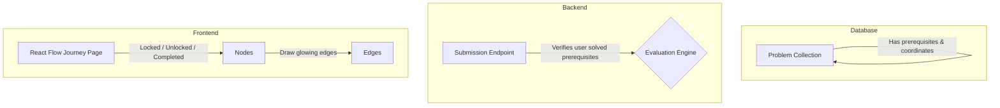

# Skill Tree Progression System (DAG): Architecture & Implementation Plan

This document explains the **Why**, **What**, and **How** of implementing the Directed Acyclic Graph (DAG) progression system (the **"Skill Tree"**) into AcECode.

---

## 1. Why Implement a Skill Tree System?

Moving from a flat problem list to a structured graph-based progression offers several key benefits:

*   **Pedagogical Guidance**: Solving random problems often leaves learning gaps. A skill tree guides users through logical learning paths (e.g., *Arrays & Strings* $\rightarrow$ *Two Pointers* $\rightarrow$ *Sliding Window* $\rightarrow$ *Graphs/DFS*).
*   **Gamification & Engagement**: Visual milestones, locked/unlocked state transitions, and glowing progress indicators trigger gamified rewards, motivating users to complete pathways.
*   **Reduced Frustration**: Preventing users from attempting complex problems before mastering the foundational building blocks ensures a higher completion rate and better comprehension.
*   **Interactive Visual Interface**: Provides a modern, slick dashboard mapping out the user's coding journey, giving them a sense of clear progression.

---

## 2. What Will We Implement?

We will implement three main components to deliver a secure and highly interactive skill tree:



### A. Database Schema Updates (MongoDB)
We will add two new properties to the `Problem` collection model:
1.  `prerequisites`: An array of `ObjectId` references to other problems. A problem cannot be attempted or submitted unless all problems in this array are marked `Accepted` (completed) in the user's submission history.
2.  `coordinates`: Flat `{ x, y }` coordinates to ensure consistent layout placement on the frontend canvas.

### B. Interactive Frontend Journey (React Flow)
We will build a `/journey` page using `reactflow` that fetches all problems and transforms them into an interactive node graph:
*   **Locked Nodes**: Rendered in muted grey with a padlock icon. Clicking them shows a tool-tip with the required prerequisites.
*   **Available Nodes**: Highlighted with an active border color, indicating they are ready to be solved.
*   **Completed Nodes**: Styled in emerald green with a glowing shadow, indicating they have been accepted.
*   **Animated Edges**: Connection lines between nodes. Paths originating from completed problems will be animated with glowing pulses (`animated: true`).

### C. Logic and Security Guards
*   **Backend Enforcer**: Since client-side state is easily bypassed, the code evaluation backend endpoint must verify that the user requesting submission has indeed completed all prerequisite problems.
*   **Frontend Unlock Animation**: When a user submits code for an "Available" problem and gets an `Accepted` result, we trigger a high-fidelity visual animation (such as particle explosions or edge-glowing pulses) as the next nodes transition from "Locked" to "Available".

---

## 3. How to Implement It: Step-by-Step

### Step 1: Database Changes (`Backend/Database/problems.js`)

We will update the `problemSchema` by appending:
```javascript
prerequisites: [{
  type: mongoose.Schema.Types.ObjectId,
  ref: 'Problem'
}],
coordinates: {
  x: { type: Number, default: 0 },
  y: { type: Number, default: 0 }
}
```

We will also ensure that our user model (or submission records) lists user progress. Currently, the user submissions are saved either on the user object or the problems themselves.
In `problems.js`, we have a submissions array: `users: [submissionsSchema]`.
In a submission verification step, we'll check if there's an `Accepted` submission for each prerequisite ID by the current user.

### Step 2: Backend Submission Guard (`Backend/routes/submission.js` or similar)

When evaluating a code submission, we intercept the request and evaluate prerequisites:
```javascript
// Example middleware or route check
const checkPrerequisites = async (req, res, next) => {
  const { problemId } = req.body;
  const userId = req.user._id; // assume authenticated user is available

  const problem = await Problem.findById(problemId);
  if (!problem) return res.status(404).json({ message: "Problem not found" });

  if (problem.prerequisites && problem.prerequisites.length > 0) {
    // Gather all accepted problems by the user
    const userSubmissions = await Problem.find({
      'users': {
        $elemMatch: {
          user: userId,
          Status: 'Accepted'
        }
      }
    }).select('_id');

    const solvedProblemIds = userSubmissions.map(p => p._id.toString());
    const unmetPrerequisites = problem.prerequisites.filter(
      prereqId => !solvedProblemIds.includes(prereqId.toString())
    );

    if (unmetPrerequisites.length > 0) {
      return res.status(403).json({
        success: false,
        message: "Unlock prerequisites before submitting solutions for this problem!"
      });
    }
  }
  next();
};
```

### Step 3: React Flow Frontend Layout (`src/components/Journey.js`)

1. Install `reactflow` in the React frontend:
   `npm install reactflow`
2. Create custom node types for rendering nodes in three statuses:
```javascript
import React from 'react';
import { Handle, Position } from 'reactflow';

export const ProblemNode = ({ data }) => {
  const { label, status } = data;
  
  let nodeStyle = {};
  let icon = null;

  if (status === 'locked') {
    nodeStyle = { background: '#27272a', border: '2px solid #52525b', color: '#71717a' };
    icon = '🔒';
  } else if (status === 'completed') {
    nodeStyle = { background: '#022c22', border: '2px solid #10b981', color: '#34d399', boxShadow: '0 0 15px rgba(16, 185, 129, 0.4)' };
    icon = '✅';
  } else { // unlocked / available
    nodeStyle = { background: '#172554', border: '2px solid #3b82f6', color: '#60a5fa', boxShadow: '0 0 10px rgba(59, 130, 246, 0.3)' };
    icon = '🚀';
  }

  return (
    <div style={{ padding: '10px 15px', borderRadius: '8px', ...nodeStyle }}>
      <Handle type="target" position={Position.Top} />
      <div style={{ display: 'flex', alignItems: 'center', gap: '8px' }}>
        <span>{icon}</span>
        <strong>{label}</strong>
      </div>
      <Handle type="source" position={Position.Bottom} />
    </div>
  );
};
```

3. Construct nodes and edges from the dynamic API response:
```javascript
const nodeTypes = { problemNode: ProblemNode };

// Inside Journey Component
const buildFlowElements = (problems, userAcceptedList) => {
  const nodes = problems.map(prob => {
    // Determine status
    let status = 'unlocked';
    if (userAcceptedList.includes(prob._id)) {
      status = 'completed';
    } else if (prob.prerequisites && prob.prerequisites.length > 0) {
      const allSolved = prob.prerequisites.every(id => userAcceptedList.includes(id));
      if (!allSolved) status = 'locked';
    }

    return {
      id: prob._id,
      type: 'problemNode',
      data: { label: prob.problemName, status },
      position: prob.coordinates || { x: 0, y: 0 }
    };
  });

  const edges = [];
  problems.forEach(prob => {
    if (prob.prerequisites) {
      prob.prerequisites.forEach(prereqId => {
        const isSourceCompleted = userAcceptedList.includes(prereqId);
        edges.push({
          id: `e-${prereqId}-${prob._id}`,
          source: prereqId,
          target: prob._id,
          animated: isSourceCompleted,
          style: { stroke: isSourceCompleted ? '#10b981' : '#4b5563', strokeWidth: 2 }
        });
      });
    }
  });

  return { nodes, edges };
};
```

### Step 4: Unlock Particle and Glow Transitions
Using canvas particles (`canvas-confetti` or custom canvas overlays) or Framer Motion wrapper, we can intercept visual status changes. If a node transitions to `completed`, we launch a canvas particle explosion and flash the target edges with neon green pulses to make the unlocking action look extremely polished.
